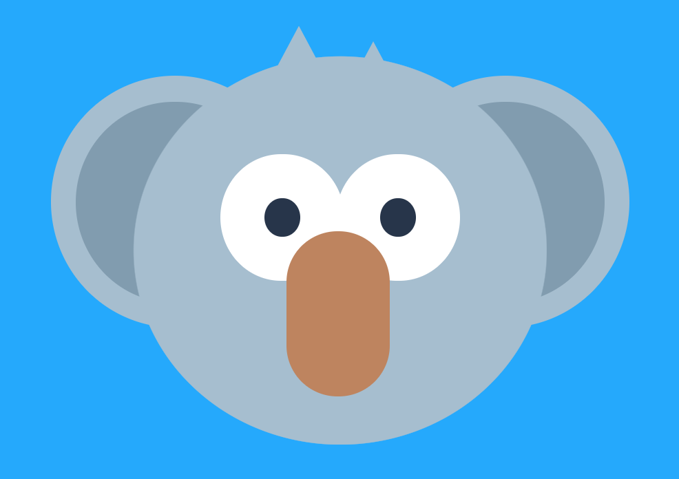

# Recreate the Koala

## Task 1

Practice your HTML and CSS skills to recreate the picture of a [koala](./koala.png). You can use [sites like this](https://css-tricks.com/the-shapes-of-css/) to search how to make certain shapes, but have a think about how you would go about it before you just use the examples in here so that they make sense to you.

## Extra Task 1

Can you refactor your code to make it responsive? Try using relative units like `%` or `vw`, `vh` rather than absolute units like `px`. Make sure you commit before you start to work on the refactor, or you'll lose all your progress if it goes wrong

## Extra Task 2

Can you animate the Koala? You'll have to research how to use CSS animations and transitions :) You can use documentation such as [W3 Schools](https://www.w3schools.com/css/css3_animations.asp) as a starting point, although there are plenty of cool resources online to find.

